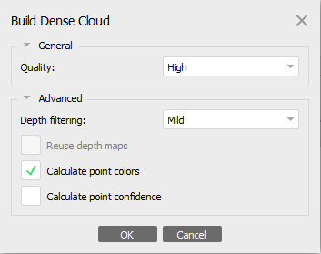
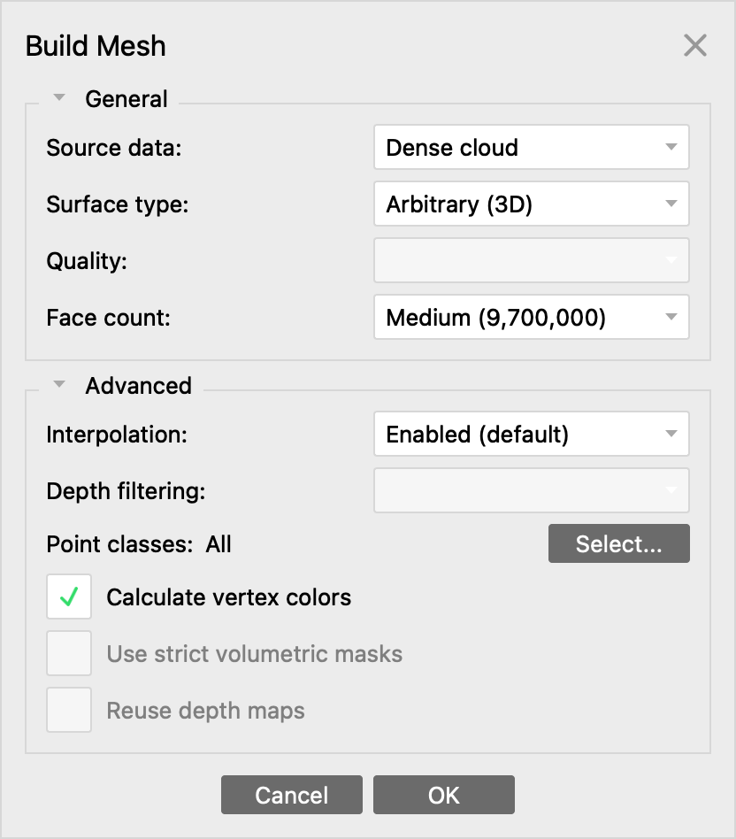

# Tutorial_Orthophotos
Building orthophotos from GoPro images 

This tutorial show you the different steps to follow in order to make an orthophoto of the forest ground based on GoPro images taken 6m above the ground and under the canopy. 

## Orthophotos from derived product of raw image 

### 1. Import the photos 
Workflow menu -> Add Photos 

### 2. Change the camera calibration to fish eye 
Tools menu -> Camera Calibration...

In newly opened window, change the Camera type option and select "Fisheye"

### 3. Align the photo

Workflow menu -> Align Photos 

The new window should look like this : 

**Figure 1: Alignment parameters** 

The parameters selected are the ones that matched best our dataset but you can modify the accuracy alignment if it does not correspond to yours. 

### 4. Build Dense Cloud 

Workflow menu -> Build Dense Cloud 

**Figure 2 : Dense Cloud construction parameters**

### 5. Build Mesh

In order to create an orthophoto you need to create either a Mesh or a DEM model because the creation rely on a based surface. 

**Figure 2 : Mesh construction parameters**

### 6. Build DEM 

**Figure 4: Digital Elevation Model parameters**

### 7. Build Orthomoisaic 

generate report ? 

## Orthophotos from filtered point cloud 

The idea is to filter the tree stem in the point cloud by calculating the normal value of the dense cloud surface. Meaning that the previous steps until the 5th are reused.

### 6. Export the Point Cloud 

[]

### 7. Import in Cloud Compare 

[]

### 8. Calculate Normals 

Edit -> Normals -> Compute 

[normal options]

Edit -> Normals -> Export to SF (scalar field)

Once the normals are considered a SF, you can display the classified Point Cloud based on their normal value. We chose to filter the values that were superior to 0.6. 

Edit -> Scalar Fields -> Filter by Value 

Export or Split

### 9. Import filtered dense cloud in Metashape 

File -> Import -> Import Points 

### 10. Build DEM based on Point Cloud 

### 11. Build mosaic 

